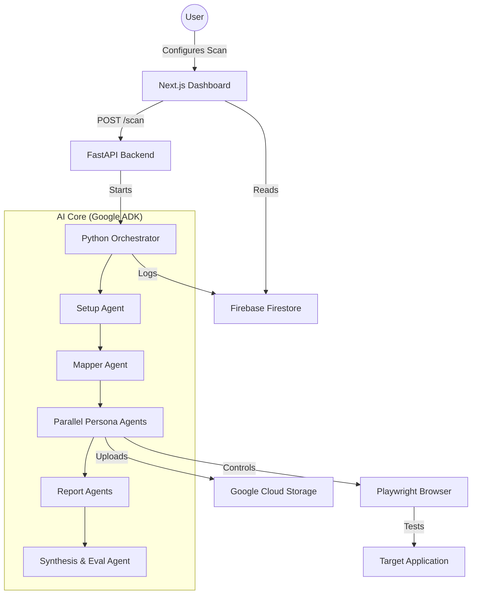

# 🚀 ScriptSim: AI-Powered Parallel QA Testing

ScriptSim is a state-of-the-art automated QA testing platform that deploys multiple AI-driven "User Personas" to explore, test, and find bugs in web applications simultaneously. By simulating real-world user behaviors—from confused children to technical power users—ScriptSim provides comprehensive coverage that traditional automated tests often miss.


## ✨ Key Features

- **🎭 Multi-Persona Testing**: Deploy agents like the "8-Year-Old" (random clicking), "Power User" (technical stress testing), and "Anxious Parent" (privacy/security focus).
- **⚡ Parallel Execution**: Run multiple testing sessions concurrently to slash QA time.
- **🗺️ Automated Site Mapping**: Phase-based approach that first crawls your application to build a comprehensive feature map.
- **📑 Structured Bug Reporting**: Automatically deduplicated, scored, and ranked bug reports powered by Gemini 2.5 Flash.
- **📸 Evidence Capture**: Automated screenshots captured for every discovered issue, stored in Google Cloud Storage.
- **📊 Live Activity Stream**: Real-time logging of agent thoughts, actions, and discoveries as they happen.

## 🏗️ System Architecture

ScriptSim operates as a multi-phase agentic pipeline orchestrated by the **Google ADK**. The architecture is designed to transition from broad structural discovery to deep, persona-driven exploitation.

### The 5-Phase Pipeline:
1.  **Phase 1: Setup**: Authenticates the session, handles login redirects, and captures persistent storage state (cookies/localStorage).
2.  **Phase 2: Discovery (Mapper)**: A broad-crawler that identifies every clickable element, form, and navigation path to build a structured DOM map.
3.  **Phase 3: Simulation (Parallel Personas)**: Multiple agents with distinct psychological profiles explore the app simultaneously using the discovered map.
4.  **Phase 4: Extraction (Report Agents)**: Structured parsers that convert raw action logs into formal Pydantic bug models.
5.  **Phase 5: Evaluation (Senior QA)**: A final high-level agent that deduplicates findings, calculates cross-persona severity boosts, and ranks the report.

## 🧠 Key Design Decisions

-   **Agentic Personas**: Instead of brittle scripts, we use LLM-based personas. This allows the system to find "logical" bugs (e.g., a power user trying to skip a payment step) that traditional tools would miss.
-   **Stateless Frontend / Stateful Backend**: The Next.js dashboard is a "thin" observer. The true state lives in **Firebase Firestore**, allowing the dashboard to be purely reactive to backend events.
-   **Isolated Browser Contexts**: Each persona runs in a unique, isolated Playwright context. This prevents session interference and allows for accurate simulation of multiple users interacting with the system at once.
-   **Schema-First Reporting**: Every bug is validated against a Pydantic schema before it reaches the database. This ensures the dashboard always has the required fields (title, steps, severity) without UI crashes.

## 🧪 Testing & Quality Assurance

We use a layered testing approach to ensure ScriptSim remains stable during rapid development:

-   **Import Integrity**: `scripts/test_imports.py` verifies that the backend restructuring hasn't broken internal module resolutions.
-   **Storage Verification**: `scripts/verify_screenshot.py` checks that GCS buckets are writable and that the dashboard proxy can correctly serve images with the right headers.
-   **Agent Validation**: Individual agent logic can be tested using `scripts/test_agent.py` to ensure prompts and schemas are behaving as expected.
-   **App Integration**: We run "Smoke Tests" against our internal `apps/` library (Shop, Jobs, Health) to verify the agents' ability to navigate different DOM structures.

## 🏗️ Architecture Diagram



## 📂 Project Structure

```text
scriptsim/
├── backend/            # Python Core
│   ├── agents/         # AI Agent definitions (ADK)
│   ├── api/            # FastAPI endpoints
│   ├── schemas/        # Pydantic data models
│   ├── tools/          # Playwright browser tools
│   └── orchestrator.py # Pipeline execution logic
├── frontend/           # Next.js Dashboard
├── apps/               # Target Demo Applications
│   ├── shop/           # E-commerce template (Port 5000)
│   ├── job_board/      # Talent platform (Port 5001)
│   └── doctor_booking/ # Healthcare platform (Port 5002)
├── docs/               # Documentation & Guides
├── scripts/            # Utility & Maintenance scripts
└── start.py            # Unified service orchestrator
```

## 🛠️ Tech Stack

- **Backend**: Python, Google ADK (Agent Development Kit), FastAPI, Playwright
- **AI**: Gemini 2.5 Flash, Vertex AI
- **Database/Storage**: Firebase Firestore, Google Cloud Storage
- **Frontend**: Next.js 14, TailwindCSS (vibrant glassmorphism design)
- **Infrastructure**: Concurrent subprocess management for multi-app deployment

## 🚀 Getting Started

### Prerequisites

- Python 3.10+
- Node.js 18+
- Google Cloud Project with Vertex AI enabled
- Firebase project for Firestore

### Installation

1. **Clone the repository**:
   ```bash
   git clone https://github.com/Shruti022/scriptsim.git
   cd scriptsim
   ```

2. **Configure Environment**:
   Create a `.env` file in the root directory:
   ```env
   GOOGLE_CLOUD_PROJECT=your-project-id
   GOOGLE_CLOUD_LOCATION=us-central1
   SCREENSHOT_BUCKET=your-screenshots-bucket
   ```

3. **Install Dependencies**:
   The `start.py` script handles most installations, but you can manually install if needed:
   ```bash
   pip install -r backend/api/requirements.txt
   cd frontend && npm install && cd ..
   ```

### Running the Platform

Use the unified startup script to launch the dashboard, API, and all demo apps:

```bash
python start.py
```

- **Dashboard**: `http://localhost:3000`
- **Shop App**: `http://localhost:5000`
- **Job Board**: `http://localhost:5001`
- **Doctor Booking**: `http://localhost:5002`

## 🧪 Testing Personas

| Persona | Behavior | Strategy |
| :--- | :--- | :--- |
| **👶 8-Year-Old** | Random, curious | Clicks everything, gets stuck, finds UI dead-ends. |
| **💻 Power User** | Fast, technical | Uses shortcuts, inspects forms, tries to bypass logic. |
| **🛡️ Anxious Parent** | Skeptical, slow | Focuses on privacy links, terms, and safety banners. |
| **👓 Retiree** | Simplified | Looks for high contrast, large buttons, and clear FAQs. |

## 🤝 Contributing

Contributions are welcome! Please feel free to submit a Pull Request.

## 📄 License

This project is licensed under the MIT License - see the LICENSE file for details.

---
Built with ❤️ for the future of Automated QA.
