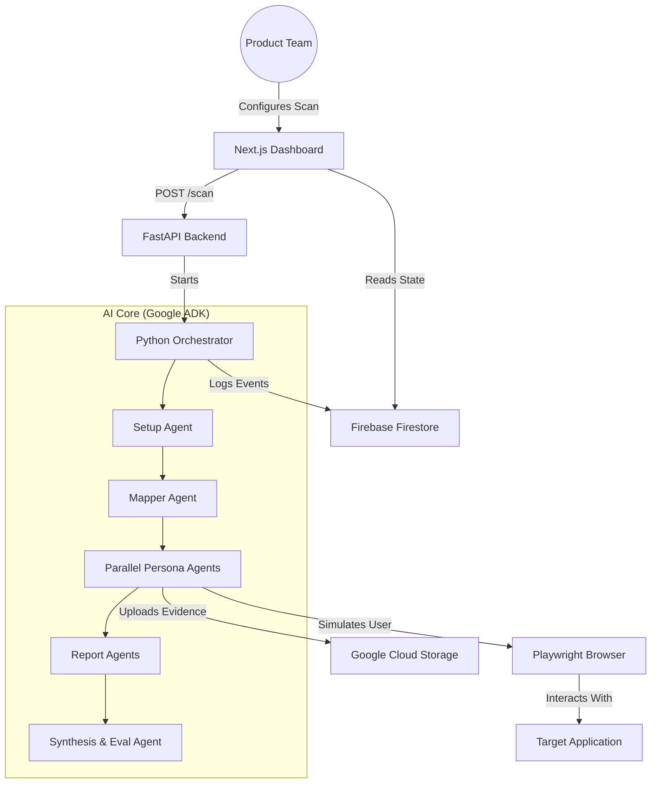

# 🚀 ScriptSim: AI-Powered Behavioral Accessibility Testing

ScriptSim is an AI-driven accessibility and usability testing platform that leverages multiple autonomous user agents to simulate diverse real-world user behaviors. Instead of relying on static rules or scripted test cases, ScriptSim models how different types of users—such as elderly individuals, children, or cautious users—interact with web applications to uncover accessibility gaps, usability breakdowns, and real-world interaction failures.

Traditional accessibility tools primarily focus on surface-level compliance checks (e.g., missing labels or contrast issues). In contrast, ScriptSim goes a step further by identifying **behavioral accessibility issues**—situations where users struggle to navigate, understand, or safely interact with a system despite it being technically compliant.

## ✨ Key Features

- **🎭 Autonomous User Personas**: Simulate interactions from users with diverse needs, including elderly individuals (simplified navigation), children (high cognitive load), and power users (technical stress).
- **🧠 Behavioral Insight**: Detect issues related to cognitive load, navigation clarity, and readability that static scanners miss.
- **⚡ Parallel Simulation**: Deploy multiple agents simultaneously to explore diverse user journeys in a fraction of the time.
- **📑 Structured ranked reports**: Get actionable insights with deduplicated, scored, and ranked bug reports powered by Gemini 2.5 Flash.
- **📸 Evidence Capture**: Automated screenshots captured for every usability breakdown, providing clear visual context for developers.
- **📊 Live Activity Stream**: Real-time logging of agent reasoning and interaction failures as they occur.

## 🏗️ System Architecture

ScriptSim operates as a multi-phase agentic pipeline orchestrated by the **Google ADK**. The architecture is designed to transition from broad structural discovery to deep, persona-driven exploitation of usability gaps.

### The 5-Phase Pipeline:
1.  **Phase 1: Setup**: Authenticates the session and captures persistent storage state to ensure a consistent user environment.
2.  **Phase 2: Discovery (Mapper)**: Crawls the application to identify navigation paths and UI components, building a "Usability Map."
3.  **Phase 3: Simulation (Parallel Personas)**: Multiple agents explore the app simultaneously using the map to test different accessibility scenarios.
4.  **Phase 4: Extraction (Report Agents)**: Structured parsers that convert raw interaction logs into formal usability bug models.
5.  **Phase 5: Evaluation (Senior QA)**: A final agent that deduplicates findings and ranks them based on impact to inclusive design standards.

## 🧠 Key Design Decisions

-   **Inclusive Design Focus**: We prioritize agents that test "User Friction" rather than just code errors. If an agent with "High Cognitive Load" gets stuck, it's a bug—even if the code is technically correct.
-   **Stateless Frontend / Stateful Backend**: The Next.js dashboard is a reactive observer. The core state lives in **Firebase Firestore**, ensuring real-time activity updates for distributed teams.
-   **Schema-First Reporting**: Every usability gap is validated against a Pydantic schema, ensuring developers get standardized data (affected persona, severity, steps to reproduce).

## 🏗️ Architecture Diagram



## 🧪 Testing Personas (Inclusive Suite)

| Persona | Behavioral Profile | Accessibility Focus |
| :--- | :--- | :--- |
| **👓 Elderly User** | Simplified, cautious | Focuses on high-contrast, large targets, and clear confirmation messages. |
| **👶 Young Child** | Impulsive, random | Tests for cognitive overload, distracting UI, and unintended navigation. |
| **🛡️ Cautious User** | High anxiety | Scrutinizes privacy links, terms of service, and security indicators. |
| **💻 Power User** | Efficient, technical | Tests the limits of "Expert Mode" features and keyboard accessibility. |

## 📂 Project Structure

```text
scriptsim/
├── backend/            # Python Core
│   ├── agents/         # AI Agent definitions (ADK)
│   ├── api/            # FastAPI endpoints
│   ├── schemas/        # Pydantic data models
│   ├── tools/          # Playwright browser tools
│   └── orchestrator.py # Pipeline execution logic
├── frontend/           # Next.js Dashboard
├── apps/               # Target Demo Applications (Shop, Jobs, Healthcare)
├── docs/               # Documentation & Guides
├── scripts/            # Utility & Maintenance scripts
└── start.py            # Unified service orchestrator
```

## 🚀 Getting Started

1. **Clone the repo**: `git clone https://github.com/Shruti022/scriptsim.git`
2. **Environment**: Create `.env` with `GOOGLE_CLOUD_PROJECT` and `SCREENSHOT_BUCKET`.
3. **Run**: `python start.py`

---
Built for product teams who believe that **compliant** isn't the same as **inclusive**.
