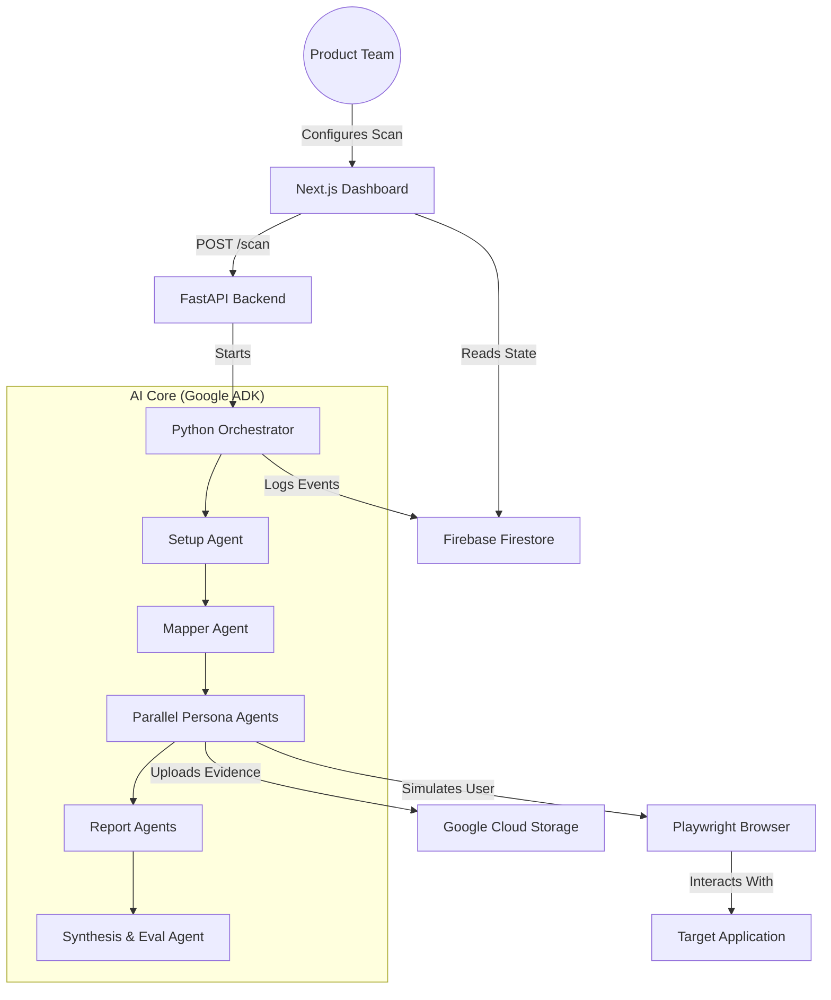

# 🚀 ScriptSim: AI-Powered Behavioral Accessibility Testing

ScriptSim is an AI-driven accessibility and usability testing platform that leverages multiple autonomous user agents to simulate diverse real-world user behaviors. Instead of relying on static rules or scripted test cases, ScriptSim models how different types of users—such as elderly individuals, children, or cautious users—interact with web applications to uncover accessibility gaps, usability breakdowns, and real-world interaction failures.

Traditional accessibility tools primarily focus on surface-level compliance checks (e.g., missing labels or contrast issues). In contrast, ScriptSim goes a step further by identifying **behavioral accessibility issues**—situations where users struggle to navigate, understand, or safely interact with a system despite it being technically compliant.

**Live demo:** [https://frontend-644775198874.us-central1.run.app](https://frontend-644775198874.us-central1.run.app)  
**Backend API:** [https://backend-644775198874.us-central1.run.app](https://backend-644775198874.us-central1.run.app)  
**GitHub:** [https://github.com/Shruti022/scriptsim](https://github.com/Shruti022/scriptsim)  
**Deployed on:** Google Cloud Run (GCP project: `agentic-fp-scriptsim`, region: `us-central1`)

## ✨ Key Features

- **🎭 Autonomous User Personas**: Simulate interactions from users with diverse needs, including elderly individuals (simplified navigation), children (high cognitive load), and power users (technical stress).
- **🧠 Behavioral Insight**: Detect issues related to cognitive load, navigation clarity, and readability that static scanners miss.
- **⚡ Parallel Simulation**: Deploy multiple agents simultaneously to explore diverse user journeys in a fraction of the time.
- **📑 Structured ranked reports**: Get actionable insights with deduplicated, scored, and ranked bug reports powered by Gemini 2.5 Flash.
- **📸 Evidence Capture**: Automated screenshots captured for every usability breakdown, providing clear visual context for developers.
- **📊 Live Activity Stream**: Real-time logging of agent reasoning and interaction failures as they occur.

---

## 🎓 Class Concepts Used

### 1. Multi-Agent Orchestration (SequentialAgent + ParallelAgent)
**Slides:** `Mar 09 - Agent Frameworks` (ADK Core Primitives table; `output_key` pipeline communication slide; `InMemorySessionService`; slide 37: `output_schema` constraint and the hard rule that it is mutually exclusive with `tools`); `Mar 23 - Multi-Agent Patterns` (slides 28–33: Deep Research pattern — Planner → parallel Researchers → Synthesizer/Critic — the exact structure ScriptSim implements)  
**Files:** `backend/orchestrator.py`, `backend/agents/setup_agent.py`, `backend/agents/persona_agent.py`

The pipeline is a nested composition of Google ADK agent types. The outer pipeline is a `SequentialAgent` (setup → personas → reports → synthesis → eval). Inside phase 3, four `PersonaAgent` instances run inside a `ParallelAgent` — each in a truly isolated asyncio task with its own `BrowserContext`. Agents communicate exclusively through a shared session state dictionary managed by ADK's `InMemorySessionService`. Each agent writes to a named `output_key` (e.g. `action_log_kid`) and the next agent reads it via template substitution (`{action_log_kid}`) in its instruction. No agent calls another directly.

### 2. Tool-Augmented Agents (ReAct Loop)
**Slides:** `Feb 16 - Tool Calling` (tool anatomy: name/description/parameters/required; the tool-calling loop); `Apr 27 - Industry Trends` (slide 8: ReAct = Reason + Act + Observe, citing Yao 2022 — directly maps to ScriptSim's loop: `get_page_state` = Observe, LLM persona reasoning = Reason, `click_element`/`type_text`/etc. = Act)  
**Files:** `backend/agents/persona_agent.py`, `backend/tools/click_element.py`, `backend/tools/get_page_state.py`, `backend/tools/log_bug.py`, `backend/tools/take_screenshot.py`

Each PersonaAgent operates in a ReAct loop: it calls `get_page_state` to observe the current page (URL, buttons, inputs, visible errors), reasons about what a person of its type would do next, then calls a tool (`click_element`, `type_text`, `hover_element`, `go_back`, `log_bug`, `take_screenshot`). Tools are async Playwright functions wrapping a real Chromium browser. The LLM drives the interaction; Playwright executes it. This is not a scripted test — the agent decides what to do at each step.

### 3. Structured Output Schemas (Pydantic + ADK output_schema)
**Slides:** `Feb 16 - Constrained Decoding` (slide 20: Pydantic `BaseModel` as the constraint template; inference engines compile schemas to Regex/CFG to guarantee valid JSON output); `Mar 09 - Agent Frameworks` (slide 37: ADK's `output_schema` parameter enforces this — and explicitly prohibits combining it with `tools` on the same agent, which shaped the two-tier design)  
**Files:** `backend/schemas/bug_report.py`, `backend/agents/report_agent.py`, `backend/agents/synthesis_agent.py`, `backend/agents/eval_agent.py`

The ReportAgent, SynthesisAgent, and EvalAgent all use ADK's `output_schema` parameter with Pydantic models. This forces the LLM to emit valid, typed JSON that maps exactly to `BugReport`, `DeduplicatedBugList`, and `FinalReport` schemas. The Pydantic models enforce fields like `severity: int (1-5)`, `steps_to_reproduce: str`, `personas_affected: List[str]`, and `confusion_areas: List[str]` — output developers can immediately act on or file as tickets.

### 4. Parallel Agent Execution with Isolated Browser Contexts
**Slides:** `Apr 20 - Agents as Functions` (agent as function `f(instructions, tools)(messages) → output`; `asyncio.gather` for running parallel agent instances); `Mar 23 - Multi-Agent Patterns` (slides 1–20: single-agent ceiling — instruction confusion, tool sprawl, context pollution — motivates splitting into specialized parallel agents)  
**Files:** `backend/orchestrator.py`, `backend/tools/browser.py`

Four persona agents run concurrently inside a single asyncio event loop. Browser isolation is the hard part: all four agents call the same tool functions, so there is no "one page per agent" default. The solution maps each `asyncio.current_task()` ID to its own `BrowserContext` in a `_contexts` dict in `browser.py`. When `get_page()` is called, it looks up the calling task's context and returns that task's isolated `Page`. The session state captured by `login.py` (full Playwright `storage_state()` — cookies + localStorage) is injected into each new context so every persona starts already authenticated without re-running the login flow.

### 5. Evaluation Agent with Behavioral Metrics
**Slides:** `Feb 09 - Evaluation` (Three Pillar Framework: Dataset, Metrics, Methods; Model-as-a-Judge — an LLM grades outputs produced by another LLM, exactly how `EvalAgent` re-ranks bugs from `SynthesisAgent`)  
**Files:** `backend/agents/eval_agent.py`, `backend/schemas/bug_report.py`

A dedicated `EvalAgent` re-ranks bugs from the synthesis step and produces behavioral metrics beyond a simple bug list: `friction_score` (1–10 scale), `time_on_task_seconds` (tracked deterministically by the orchestrator via `persona_stats` timestamps), `total_actions` (counted from action logs), and `confusion_areas` (descriptive strings like "Retried search button 3 times — assumed it was broken"). These metrics move the output from a bug tracker into a UX intelligence layer — the same information an accessibility researcher would capture in a think-aloud study, automated.

---

## 🏗️ System Architecture

ScriptSim operates as a multi-phase agentic pipeline orchestrated by the **Google ADK**. The architecture is designed to transition from broad structural discovery to deep, persona-driven exploitation of usability gaps.

### The 5-Phase Pipeline:
1.  **Phase 1: Setup**: Authenticates the session and captures persistent storage state to ensure a consistent user environment.
2.  **Phase 2: Discovery (Mapper)**: Crawls the application to identify navigation paths and UI components, building a "Usability Map."
3.  **Phase 3: Simulation (Parallel Personas)**: Multiple agents explore the app simultaneously using the map to test different accessibility scenarios.
4.  **Phase 4: Extraction (Report Agents)**: Structured parsers that convert raw interaction logs into formal usability bug models.
5.  **Phase 5: Evaluation (Senior QA)**: A final agent that deduplicates findings and ranks them based on impact to inclusive design standards.

## 🏗️ Architecture Diagram


```mermaid
graph TD
    User((Product Team)) -->|Configures Scan| Dashboard[Next.js Dashboard]
    Dashboard -->|POST /scan| API[FastAPI Backend]
    API -->|Starts| Orchestrator[Python Orchestrator]
    
    subgraph "AI Core (Google ADK)"
        Orchestrator --> Setup[Setup Agent]
        Setup --> Mapper[Mapper Agent]
        Mapper --> Parallel[Parallel Persona Agents]
        Parallel --> Report[Report Agents]
        Report --> Synthesis[Synthesis & Eval Agent]
    end
    
    Parallel -->|Simulates User| Browser[Playwright Browser]
    Browser -->|Interacts With| TargetApp[Target Application]
    
    Parallel -->|Uploads Evidence| GCS[Google Cloud Storage]
    Orchestrator -->|Logs Events| Firestore[Firebase Firestore]
    Dashboard -->|Reads State| Firestore
```

---

## 🧠 Key Design Decisions

-   **Inclusive Design Focus**: We prioritize agents that test "User Friction" rather than just code errors. If an agent with "High Cognitive Load" gets stuck, it's a bug—even if the code is technically correct.
-   **Stateless Frontend / Stateful Backend**: The Next.js dashboard is a reactive observer. The core state lives in **Firebase Firestore**, ensuring real-time activity updates for distributed teams.
-   **Schema-First Reporting**: Every usability gap is validated against a Pydantic schema, ensuring developers get standardized data (affected persona, severity, steps to reproduce).
- **"Begin." as the pipeline trigger**: ADK's `SequentialAgent` passes the same user message to every sub-agent. A descriptive message like "Run QA scan" caused SetupAgent (which only has a `login` tool) to refuse with "I cannot run a full QA scan." The neutral `"Begin."` forces each agent to rely entirely on its own instruction.
- **Report agents run sequentially, not in parallel**: Running all 4 report agents in parallel right after 4 parallel persona agents caused 429 rate limit errors from Vertex AI. Sequential execution spaces out the API calls at the cost of ~30 extra seconds per scan.
- **Mapper is skipped**: The mapper gets stuck in an infinite loop on apps with non-navigating buttons like "Add to Cart" — clicks the button, nothing navigates, calls `go_back` from homepage (no history), lands on `about:blank`, repeats. Personas find bugs effectively without a feature map.
- **output_schema and tools on different agents**: ADK enforces a hard constraint: an agent cannot have both `tools` and `output_schema`. PersonaAgents have 7 tools, no schema (free exploration). ReportAgents have a Pydantic schema, no tools (structured extraction). This shaped the entire two-tier architecture.

---

## 🎭 Testing Personas (Inclusive Suite)

| Persona | Behavioral Profile | Accessibility Focus | Bug Focus |
| :--- | :--- | :--- | :--- |
| **👓 Elderly User** (67yo) | Simplified, cautious | Focuses on high-contrast, large targets, and clear confirmation messages. | Small touch targets, auto-dismiss popups, missing help text |
| **👶 Young Child** (8yo) | Impulsive, random | Tests for cognitive overload, distracting UI, and unintended navigation. | Crashes, confusing labels, invalid input accepted |
| **🛡️ Cautious User** (45yo) | High anxiety | Scrutinizes privacy links, terms of service, and security indicators. | Vague errors, missing confirmations, broken trust signals |
| **💻 Power User** (22yo dev) | Efficient, technical | Tests the limits of "Expert Mode" features and keyboard accessibility. | Security holes, missing validation, stack traces exposed |

---

## 🧪 Demo Apps and Planted Bugs

Three Flask apps with deliberate planted bugs — the system's test targets.

**ScriptSim Shop** (port 5000) — `apps/shop/app.py`  
Login: `test@scriptsim.com` / `TestPass123!`
- XSS in search — query rendered with Jinja `|safe` filter
- Silent cart failure — "Super Gadget" shows success but is never added
- Crash at 10+ items — `ValueError` → 500 error page
- Confusing error message — "The chickens have come home to roost"
- Frozen checkout — button permanently disabled with no explanation

**TalentHub Jobs** (port 5001) — `apps/job_board/app.py`  
Login: `user@talenthub.com` / `JobPass123!`
- Applications not persisted — apply succeeds, but "My Applications" is always empty
- Sort by salary silently ignored — query param received, never applied
- Crash on duplicate apply — `RuntimeError` → 500

**MediBook Health** (port 5002) — `apps/doctor_booking/app.py`  
Login: `patient@medibook.com` / `HealthPass123!`
- Double booking — same slot bookable multiple times with no conflict check
- IDOR on cancel — `/cancel/<id>` cancels any patient's appointment, no ownership check
- Vague confirmation — success page shows no doctor name, date, time, or reference number

---

## ✅ Confirmed Scan Results

| Scan | Target | Time | Cost | Bugs Found |
|---|---|---|---|---|
| 1 | Demo shop (local) | 631s | $0.023 | 3 |
| 2 | Demo shop (local) | 708s | $0.021 | 2 |
| 3 | saucedemo.com (public) | 618s | $0.016 | 3 |
| 4 | automationexercise.com (public) | 682s | $0.028 | 4 |

Scan 4 confirmed generalization: ScriptSim ran on a site it had never been told about and found real UX issues through persona behavior alone.

---

## 🛠️ Tech Stack

| Layer | Technology | Why |
|---|---|---|
| Agent framework | Google ADK | SequentialAgent + ParallelAgent, session state, output_schema |
| LLM (personas, setup) | Gemini 2.5 Flash-Lite via Vertex AI | Fast and cheap — ~$0.002 per persona run |
| LLM (reports, eval) | Gemini 2.5 Flash via Vertex AI | Higher reasoning quality for structured extraction |
| Browser | Playwright + Chromium (async) | Real browser — JavaScript executes, CSS renders, real UX |
| State + live feed | Google Cloud Firestore | Real-time activity stream to dashboard during scan |
| Screenshots | Google Cloud Storage | Private bucket, proxied via Next.js API route |
| API | FastAPI | Non-blocking scan trigger via background task |
| Dashboard | Next.js 14 | Firestore polling, live activity console, bug report UI |
| Demo targets | Flask | Lightweight apps with deliberately planted bugs |

---

## 📂 Project Structure

```text
scriptsim/
├── backend/            # Python Core
│   ├── agents/         # AI Agent definitions (ADK)
│   ├── api/            # FastAPI endpoints
│   ├── schemas/        # Pydantic data models
│   ├── tools/          # Playwright browser tools
│   └── orchestrator.py # Pipeline execution logic
├── frontend/           # Next.js Dashboard
├── apps/               # Target Demo Applications (Shop, Jobs, Healthcare)
├── docs/               # Documentation & Guides
├── scripts/            # Utility & Maintenance scripts
└── start.py            # Unified service orchestrator
```

---

## 🚀 Getting Started

### Prerequisites

```bash
# Python dependencies
pip install -r requirements.txt
pip install flask werkzeug

# Playwright browser
python -m playwright install chromium

# Node.js: https://nodejs.org (required for the dashboard)
```

### Environment Setup

```bash
cp .env.example .env
# Then open .env and fill in your GCP project ID
```

Required `.env` values:
```
GOOGLE_GENAI_USE_VERTEXAI=1
GOOGLE_CLOUD_PROJECT=your-gcp-project-id
GOOGLE_CLOUD_LOCATION=us-central1
```

### GCP Authentication

```bash
gcloud auth application-default login
```

Required IAM roles: `Vertex AI User`, `Cloud Datastore User`, `Storage Object Creator`

### Start All Services

```bash
python start.py
```

Open **http://localhost:3000**, select a demo app, pick personas, click **Run Parallel Scan**.

---
Built for product teams who believe that **compliant** isn't the same as **inclusive**.
